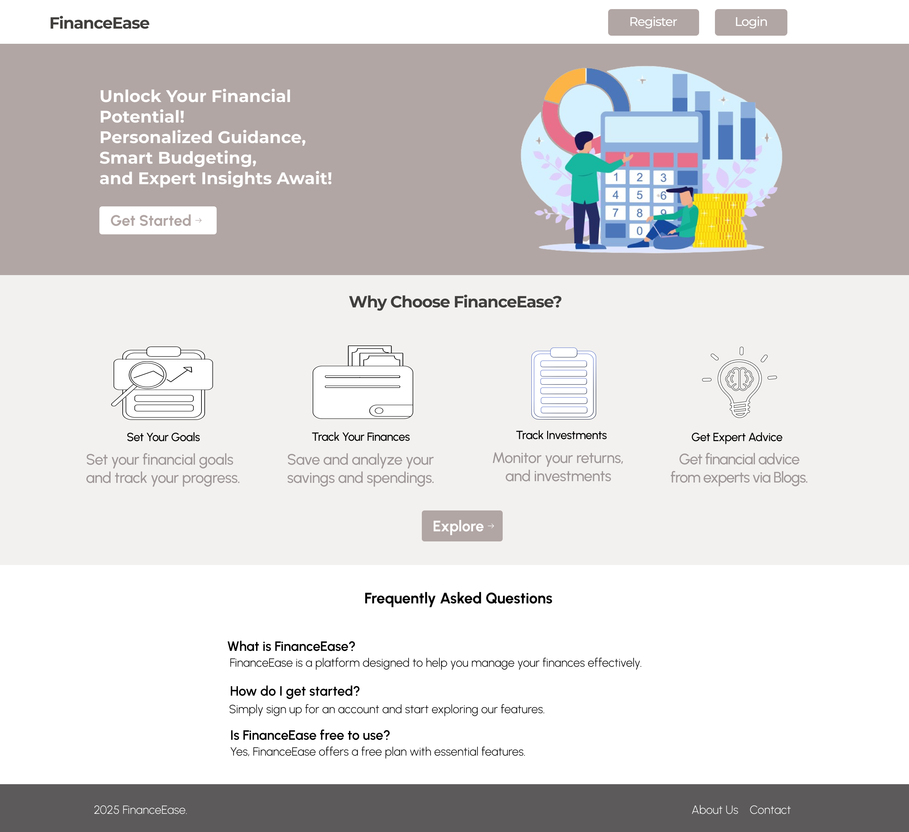

# FinanceEase

## Overview
FinanceEase is a comprehensive personal finance management platform designed to help users take control of their finances. It provides tools for budgeting, investment tracking, goal setting, and more, while also offering expert advice through blogs and consultations. The platform ensures secure access with role-based authentication for users and financial experts.

## Features
- **Budget Management**: Track expenses and set budgets to manage your finances effectively.
- **Investment Tracking**: Monitor your investments and portfolio performance.
- **Goal Setting**: Define financial goals and track progress toward achieving them.
- **Asset and Liability Management**: Keep a record of your assets and liabilities.
- **Expert Blogs**: Access financial advice and insights from experts.
- **Role-Based Access Control**: Tailored dashboards for users and financial experts.
- **Secure Authentication**: JWT-based authentication with cookie storage for enhanced security.

## Technologies Used
### Frontend
- React.js: For building a dynamic and responsive user interface.
- Tailwind CSS: For styling and ensuring a consistent design system.
- React Router: For navigation and routing.
### Backend
- Node.js: For building the server-side application.
- Express.js: For creating RESTful APIs.
- Mongoose: For interacting with MongoDB.
### Database
- MongoDB: For storing user data, financial records, and expert blogs.
### Authentication
- JWT (JSON Web Tokens): For secure user authentication and role-based access control.
### Other Tools
- Nodemon: For automatic server restarts during development.

## Contributions
- Designed and implemented the frontend using React.js and Tailwind CSS.
- Developed backend APIs for user authentication, financial data management, and expert blogs.
- Integrated JWT-based authentication and role-based access control.
- Conducted database design and optimization for MongoDB.
- Performed testing and debugging to ensure a seamless user experience.
